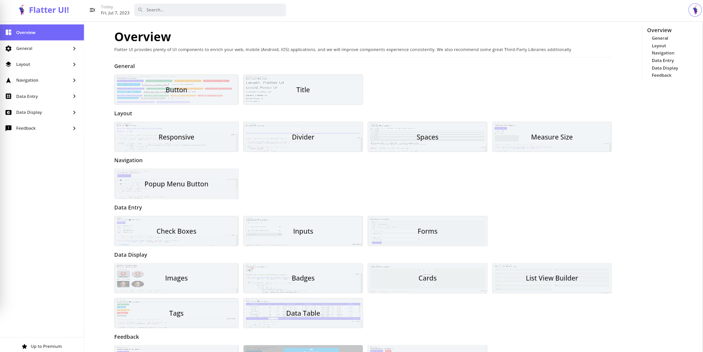
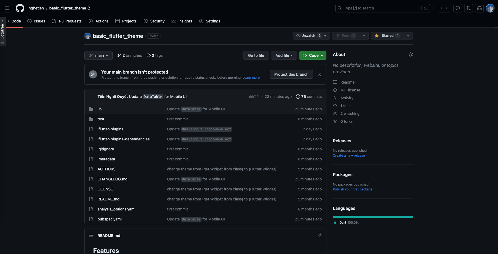

<!--
This README describes the package. If you publish this package to pub.dev,
this README's contents appear on the landing page for your package.

For information about how to write a good package README, see the guide for
[writing package pages](https://dart.dev/guides/libraries/writing-package-pages).

For general information about developing packages, see the Dart guide for
[creating packages](https://dart.dev/guides/libraries/create-library-packages)
and the Flutter guide for
[developing packages and plugins](https://flutter.dev/developing-packages).
-->

<p align="center">
  <a href="https://doc.antdf.xyz">
    
  </a>
</p>

<h1 align="center">Flatter UI</h1>

<div align="center">

A Flatter UI framework designed for web / pc application, contains some high quality widgets.

Designed for pc application at very first, so it wasn't recommand to use in mobile application even can be used.

</div>

[](https://flatter-ui-docs.web.app/)

## ✨ Features

- 🌈 Enterprise-class UI designed for web / desktop applications.
- 📦 A set of high-quality Flutter widgets out of the box.
- 🛡 Written in pure Dart with null safety.

## 🖥 Environment Support

- Working on Windows and Mac OS

## 📦 Install

```bash
flutter pub add basic_flutter_theme
```

## 🔨 Usage

```dart
import 'package:ant_design_flutter/antdf.dart';

void main() {
    runApp(
        const FlatterApp(
            home: Scaffold(
                body: Center(
                    child: BasicButton(
                        onPressed: () {},
                        text: 'Click me'
                    ),
                ),
            ),
        ),
    );
}
```

### Null Safety

`flatter` is written in dart with null safety.

## 🔗 Links

- [Home page](https://flatter-ui-docs.web.app/)
- [Widgets Overview](https://flatter-ui-docs.web.app/docs/overview)

## ⌨️ Development

Use GitHub, a free online dev environment for GitHub.

[](https://github.com/nghetien/basic_flutter_theme)

Or clone locally:

```bash
$ git git@github.com:nghetien/basic_flutter_theme.git
$ cd basic_flutter_theme
$ flutter pub get
$ flutter run
```

Now flutter will run on the connected device in your environment.

## 🤝 Contributing

We welcome all contributions. You can submit any ideas as [pull requests](https://github.com/nghetien/basic_flutter_theme) or as [GitHub issues](https://github.com/nghetien/basic_flutter_theme/issues).



## ❤️ Sponsors and Backers
